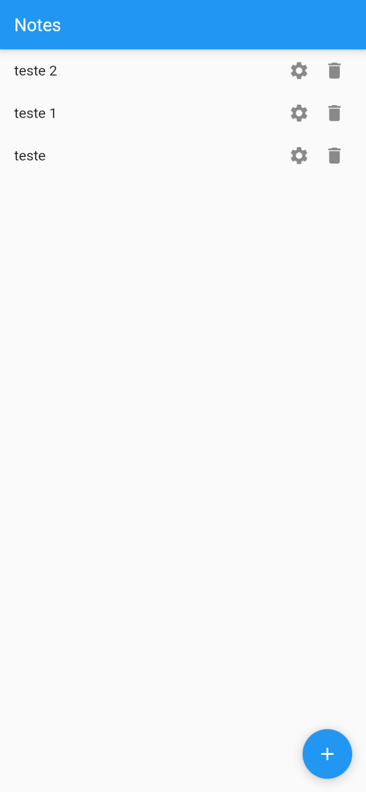

# n2-dev-mobile
# Aplicativo Flutter de CRUD com Firebase

Este é um aplicativo Flutter simples de CRUD (Create, Read, Update, Delete) que se conecta ao Firebase para realizar operações de banco de dados. Ele é projetado para fins de aprendizado e demonstração.

  

## Recursos

- Cadastro de itens.
- Leitura de itens existentes.
- Atualização de itens.
- Exclusão de itens.
- Integração com o Firebase Firestore.

## Pré-requisitos

- Flutter SDK instalado e configurado.
- Dependências Firebase adicionadas ao arquivo `pubspec.yaml`.

## Como Executar o Aplicativo

1. Clone este repositório: `git clone https://github.com/vitordefante/n2-dev-mobile.git`
2. Na pasta raiz do projeto, instale as dependencias.
`flutter pub get`
3. Crie um novo projeto no seu console do firebase.

4. Na pasta raiz do projeto, instale o firebase tools. `npm install -g firebase tools`

5. Faça o login na sua conta do firebase. `firebase login`
   

6. Ative o flutterfire cli (Lembre-se de adicionar o Flutter ao PATH) `pub global activate flutterfire_cli`

7. Conecte ao projeto do Firebase criado posteriormente. `flutterfire configure`

8. Adicione o Firebase Core. `flutter pub add firebase_core`

9. Crie uma base de dados. Vá até o seu projeto no Firebase, no menu lateral vá em Criação > Firestore Database

Create database.

Mantenha as configurações padrão.

Mantenha a localização padrão.

10. Altere as regras da base de dados.
Vá no menu superior > regras. Então altere o write de `false` para `true`

Para salvar, clique em desenvolver e testar. Pronto, o projeto está pronto para rodar.

   
